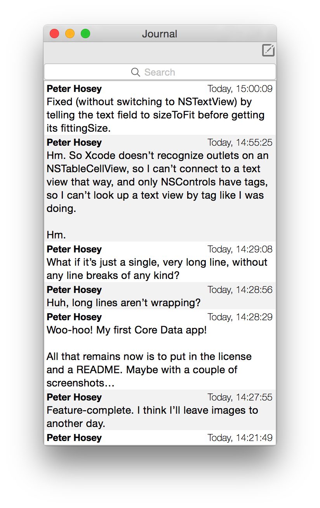
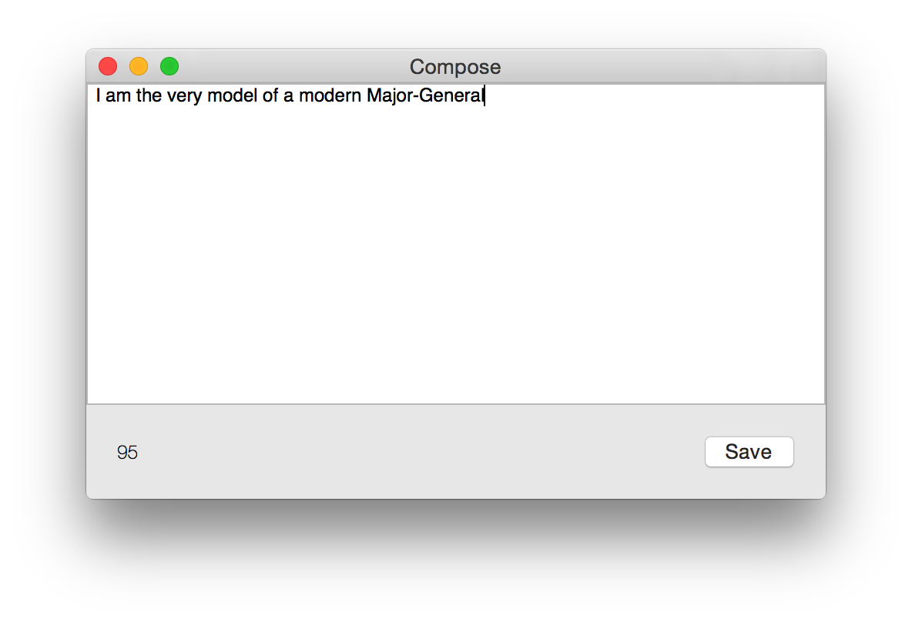

# A journal for programmers
## Background

One of the things that most helps me think is to think out loud.

But this isn't always possible. I may be sharing an office, in which case I don't want to bug my office-mate with every stray thought, question, and idea that crosses my mind. I may be thinking about things that I can't talk about.

I used to often “think out loud” on Twitter, but I can't do that anymore for job reasons, and besides, it's kind of rude to annoy the people who follow me there with my thinking-out-loud just as it would be to do it to an office-mate.

So what I need is something that works essentially the same as a Twitter client (specifically [Tweetbot](https://tapbots.com/tweetbot/mac/), which is what I use), but without actually being connected to Twitter, the internet, or indeed anybody.

So I wrote that.

This is also my first Core Data application and my first storyboard-based application, so I wrote it partly to learn to use these things.

## Requirements

OS X 10.10 or later.

## The user interface

There are two main windows.

The most main of them all is the Journal window, where all your previously-recorded entries are shown:

Then there's the Compose window, where you write a new entry:

The Compose window includes a character counter, just like on Twitter, although it isn't actually enforced here.

The character “limit” (such as it is) defaults to 140 characters, though you can change it in the Preferences to 256 (App.net) or 512 (IRC).

## You found a bug?!

Please do feel free to file bugs in [the issue tracker](https://github.com/boredzo/journal/issues) if you encounter any. I'll also happily consider pull requests.

## Copyright

See LICENSE.txt for copyright and license information.
